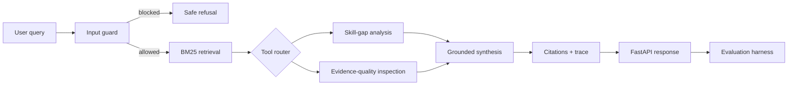

# Evidence-First Agentic RAG Evaluation Platform

> A reproducible Python system that retrieves grounded evidence, routes explicit tools through LangGraph, blocks prompt-injection patterns, reports trace-level latency, and evaluates quality against a non-agentic baseline.

This is a **portfolio system**, not a claim of a client production deployment. It is designed to make current engineering ability inspectable and measurable.

## What this proves

- Agentic workflow design with explicit state and bounded tool routing.
- Transparent BM25 retrieval with source-level citations.
- Automated evaluation of retrieval recall, required-term coverage, task success, and latency.
- Input safety checks and adversarial prompt-injection tests.
- FastAPI serving, Docker packaging, health checks, tests, and CI.
- An optional OpenAI Responses provider while retaining a deterministic offline mode.

## Architecture



Every request returns the answer, citations, tool observations, and a node-by-node trace. Consequential external actions are intentionally absent; the repository demonstrates the approval boundary rather than pretending to automate one.

## Reproduce it

```bash
python -m venv .venv
source .venv/bin/activate
pip install -e '.[dev]'
pytest -q
python scripts/run_eval.py
python scripts/demo.py
```

Run the API:

```bash
uvicorn evidence_rag.api:app --reload
curl -s http://127.0.0.1:8000/query \
  -H 'content-type: application/json' \
  -d '{"query":"What controls make an agent tool workflow safe?"}'
```

Or use Docker:

```bash
docker compose up --build
```

## Evaluation design

The committed evaluation set includes grounded-retrieval, agent safety, injection, deployment, observability, portfolio-proof, recommendation-risk, and image-fusion cases. The benchmark compares top-1 retrieval with the agentic top-3 path. Results are generated, not handwritten:

```bash
make benchmark
```

See the committed [`evals/results.md`](evals/results.md) and reproduce it locally. The
offline provider makes quality results deterministic and costs zero. Latency naturally
varies by machine. The optional OpenAI provider can be enabled only after the
deterministic path passes.

## Safety and failure behavior

- Retrieved documents are evidence, never instructions.
- Known injection phrases stop before retrieval and tools.
- Unsupported questions produce an insufficient-evidence response.
- Tools are selected from a fixed allowlist.
- Trace output exposes which nodes ran and how long they took.
- The evaluation set includes both allowed and blocked cases.

## Repository map

```text
src/evidence_rag/
  api.py          FastAPI boundary
  graph.py        LangGraph state machine
  retrieval.py    transparent BM25 retriever
  generation.py   deterministic and optional OpenAI providers
  tools.py        allowlisted analysis tools
  security.py     injection and citation checks
  service.py      application service
data/              reusable evidence corpus
evals/             fixed evaluation cases and generated reports
scripts/           demo and benchmark entry points
tests/             retrieval, safety, graph, and API tests
```

## Matcher-ready project sentence

> I built an evidence-first agentic RAG portfolio system in Python with LangGraph, transparent retrieval, automated evaluations, prompt-injection tests, trace-level latency measurements, and containerized deployment, and benchmarked it against a non-agentic baseline.

## Limits and next production steps

The default evidence corpus is deliberately small and local. A production version would add an authenticated document pipeline, durable vector and keyword indexes, model and prompt versioning, distributed traces, tenant isolation, a human approval service, red-team datasets, and deployment-specific rollback controls. The repository makes those boundaries explicit instead of overstating prototype maturity.
